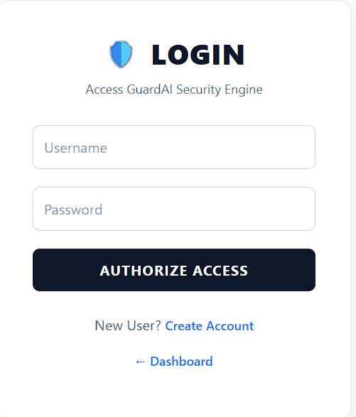
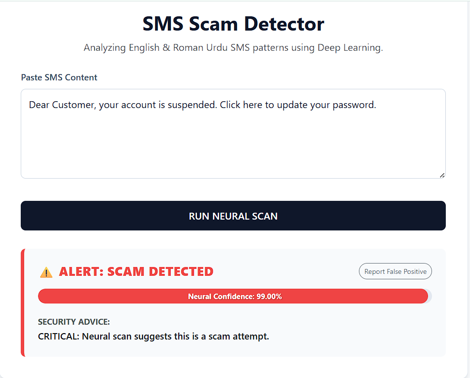

# GuardAI v1.1 🛡️

High-performance bilingual (English + Roman Urdu) scam detection system built with Machine Learning and Flask.


## Features

- ML-based scam classification for SMS/WhatsApp style text
- Hybrid detection logic (model output + heuristic checks)
- Operator authentication portal with scan history
- Feedback/reporting flow for retraining support
- SQLite-backed persistence for lightweight deployment

## Metrics

| Metric | Value |
| :--- | :--- |
| Dataset Size | 9,120+ samples |
| Validation Accuracy | 92.1% |
| Precision (Scam) | 94.2% |
| Recall | 90.8% |

## Tech Stack

- Python 3.11
- Flask, Flask-Login, Flask-SQLAlchemy
- Scikit-learn, Joblib, Pandas
- SQLite
- Bootstrap 5 + Jinja templates

## Quick Start

```bash
git clone https://github.com/rizz01107/GuardAI.git
cd GuardAI
python -m venv .venv
.venv\Scripts\activate
pip install -r requirements.txt
python app.py
```

App runs on `http://127.0.0.1:5050`.

## Environment Variables

- `GUARDAI_SECRET_KEY` - Flask secret (set this in production)
- `GUARDAI_OPEN_BROWSER` - set `true` to auto-open browser locally
- `PORT` - app port (default: `5050`)
- `FLASK_DEBUG` - set `true` for debug mode

## Security Improvements (v1.1)

- Password hashing enabled for operator accounts
- Legacy plaintext passwords auto-migrate on successful login
- Secret key can be injected via environment variable
- Basic input length checks added for safer processing

## Screenshots

<p align="center">
  
  
</p>

## Roadmap

- WhatsApp Business API integration
- OCR-based scam text extraction
- Browser extension for phishing detection
- Voice-to-text fraud analysis

## Author

- Muhammad Rizwan ([LinkedIn](https://linkedin.com/in/rizz01107))
