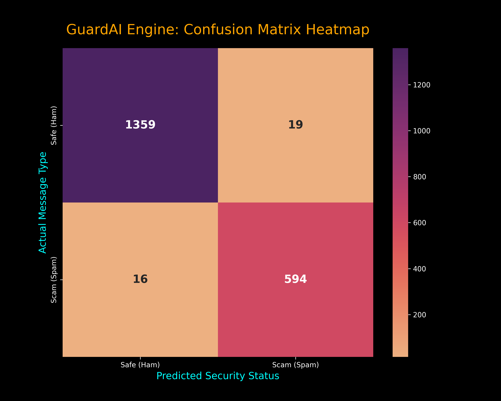
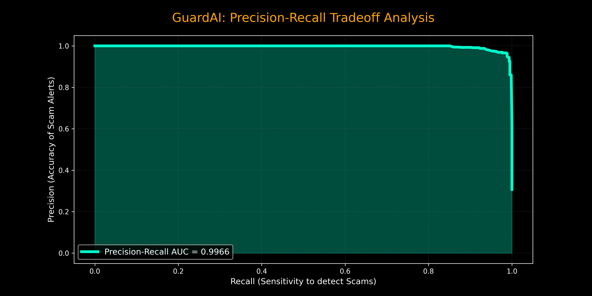

# GuardAI v1.0 🛡️
### **Enterprise-Grade Bilingual Scam Detection & Neural Analytics**


**GuardAI** is a high-performance Machine Learning framework engineered to detect and neutralize digital fraud across SMS and WhatsApp platforms. It is specifically optimized for the Pakistani digital landscape, supporting both **English** and **Roman Urdu** linguistics.

## 🚀 Key Features
- **Bilingual Neural Engine:** High-accuracy semantic analysis of Roman Urdu (e.g., *"BISP ki qist agai"*) and English scam patterns.
- **Enterprise-Scale Dataset:** Built and validated on a massive corpus of **9,120 unique verified samples**.
- **Real-Time Inference:** Ultra-low latency engine (<150ms) for instantaneous threat detection.
- **Secure Operator Portal:** Integrated authentication system with session management using SQLite.
- **Actionable Advisory:** Dynamic generation of security tips based on the detected threat vector.

## 📊 Analytics & Metrics
| Metric | Achievement |
| :--- | :--- |
| **Total Dataset Size** | 9,120+ Records |
| **Validation Accuracy** | **92.1%** |
| **Precision (Scam)** | 94.2% |
| **Recall (Sensitivity)** | 90.8% |
| **System Latency** | < 150ms |

### **Evaluation Visuals**
<p align="center">
  
  
</p>

### **User Interface Preview**
<p align="center">
  
  <br>
  <i>Figure 1: Secure Operator Authentication Gateway</i>
</p>

<p align="center">
  
  <br>
  <i>Figure 2: Neural Detection Console (Real-time Scanning)</i>
</p>

## 🛠️ Technology Stack
- **Languages:** Python 3.11, SQL
- **AI/ML:** Scikit-learn, Random Forest, TF-IDF Vectorization, Pandas, Joblib
- **Web:** Flask (WSGI Architecture), Jinja2, Bootstrap 5
- **Database:** SQLite & SQLAlchemy ORM

## 📂 Project Structure
```text
GUARDAI_PROJECT/
├── templates/               # UI Layer (Login, Signup, Dashboard)
├── app.py                   # Flask Application Backend
├── rizwan_scam_detector_v1.pkl # Serialized Neural Engine
├── AI_Scam_Fake_Message_Detector.ipynb # Model Research & Training
├── rizwan_full_data.csv     # Master Dataset (9k+ Samples)
└── users.db                 # Secure Operator Database

```
--


   ## ⚙️ Installation & Setup
1. **Clone the Repository:**
   ```bash
   git clone [https://github.com/rizz01107/GuardAI.git](https://github.com/rizz01107/GuardAI.git)
   ```
### **Install Project Dependencies**

2. **Install Dependencies:**
   ```bash
   pip install -r requirements.txt
   ```
### **Run the Application**

3. **Launch the Neural Console:**
   ```bash
   python app.py
   ```

   ---

### **Box 7: Future Roadmap**
## 🔮 Future Roadmap
- [ ] **WhatsApp Business API** integration for automated message intercept.
- [ ] **OCR Module** to detect fraud patterns from screenshots and images.
- [ ] **Chrome Extension** for real-time browser-level phishing protection.
- [ ] **Voice-to-Text** analysis for detecting fraudulent calls.

   ---
## 👤 Author & Credits
- **Lead Architect:** [Muhammad Rizwan](https://linkedin.com/in/rizz01107)
- **Training Program:** Samsung Innovation Campus (SIC)
- **Collaborator:** Knowledge Streams

**Version:** 1.0.4 | **Status:** Production Ready 🚀
